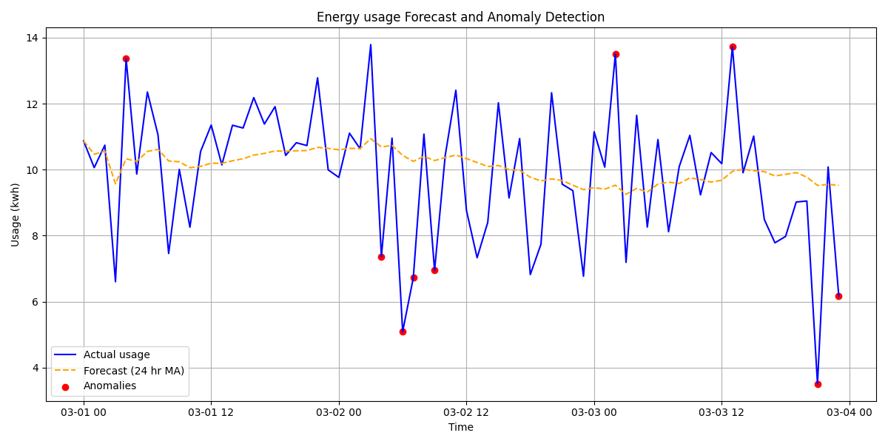
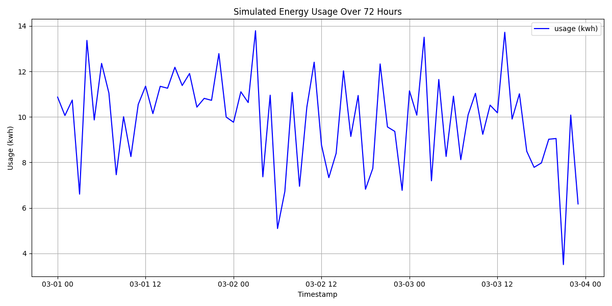

# Energy-Load-Forecasting-and-Anomaly-Detection-Dashboard

This project simulates 72 hours of hourly electric usage data and applies a basic forecasting and anomaly detection model. The goal is to demonstrate real-world forecasting logic relevant to energy market analysis — including load profiling, deviation detection, and visualization.

## 🔍 Project Purpose

Designed as a targeted demonstration for analyst roles in the energy sector (e.g., ENGIE), this project mimics the tasks of load forecasting and quality control for customer usage data.

## 📊 Features

- **Synthetic Load Dataset**: Simulates `usage_kwh`, `temperature`, and `timestamp` values for a customer over 3 days.
- **Forecasting Logic**: Implements a 24-hour moving average to forecast expected load.
- **Anomaly Detection**: Flags data points where actual usage deviates by more than 3 kWh from the forecast.
- **Visualization**: Plots actual usage vs. forecast and highlights anomalies in red.
- **CSV Output**: Saves annotated results to `forecast_results.csv` for further analysis or reporting.

## 🛠 Tech Stack

- Python 3.8+
- pandas
- matplotlib
- numpy

## 📁 File Structure
```
energy-load-forecasting-and-anomaly-detection/
├── data/
│   ├── load_data.csv              # Simulated raw usage + temperature data
│   └── forecast_results.csv       # Output data with forecast and anomaly flags
├── outputs/
│   ├── forecast_plot.png          # Line chart: actual vs forecast with anomalies
│   └── usage_plot.png             # Basic usage plot (sanity check)
├── src/
│   ├── data.py                    # Script to generate synthetic data
│   ├── load_forecasting.py       # Forecasting and anomaly detection logic
│   └── plot_usage.py             # Initial usage visualization
├── README.md
```

## 📈 Sample Output

### Forecast vs. Actual with Anomalies


### Raw Usage Overview


## 📌 Business Relevance

Forecasting and anomaly detection are core to risk management and pricing in deregulated energy markets. This project mirrors how analysts validate customer load patterns, identify irregularities, and produce actionable insights to support deal structuring and operational reliability.


